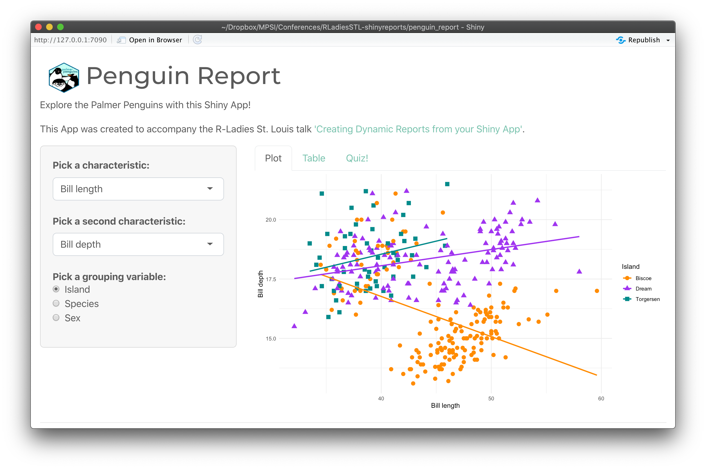

```{r setup, include=FALSE}
options(htmltools.dir.version = FALSE)
knitr::opts_chunk$set(
  fig.width=9, fig.retina=3, fig.asp = 0.618, dpi = 300,
  out.width = "90%",
  cache = FALSE,
  echo = TRUE,
  message = FALSE, 
  warning = FALSE,
  hiline = TRUE
)
```

```{r xaringan-themer, include=FALSE, warning=FALSE}
library(xaringanthemer)
style_mono_accent(
  base_color = "#68B79E",
  link_color = "#E97E87",
  text_bold_color = "#508A78",
  header_font_weight = 400,
  header_h1_font_size = "2.50rem",
  header_h2_font_size = "1.75rem",
  header_h3_font_size = "1.25rem",
  footnote_font_size = "0.7em",
  text_font_size = "1.25rem",
  code_font_size = "1.25rem",
)
```

# The Plan

.pull-left[
- Refresh our memory about Shiny
- Identify reasons for creating dynamic reports
- Look at an existing example
- Get familiar with a simple Shiny app
- Go over **three** approaches for creating reports
- Talk about a few related ideas
- Go forth and create dynamic reports!

Github repo: https://github.com/winterstat/RLadiesSTL-shinyreports
]

.pull-right[
```{r, out.width = '90%', echo = FALSE, fig.alt = "A gif of Netflix's Sex Education character Lily Iglehart saying 'Let's do this'."}
knitr::include_graphics("media/gif_letsdothis.gif")
```
]
---
# Shiny Refresher
.pull-left[
- An R package that lets you use R to build interactive web apps and dashboards

- You don't need to know HTML, CSS, or JavaScript

- Using so-called widgets the user can interact with the web app

- [An example](https://www.searchdiscovery.com/how-we-help/services/optimization/sample-size-calculator/), and another [example](https://yihanw.shinyapps.io/Recipe_Nutrition/).
]

.pull-right[
.right[
```{r, out.width = '50%', echo = FALSE, fig.alt = "The Shiny Hexagon"}
knitr::include_graphics("media/hex_shiny.png")
```
]
]

.footnote[
Learn more with these R-Ladies St. Louis talks: Kaelen Madeiros's, [Intro To Shiny](https://www.youtube.com/watch?v=8VjkatOf7Bs&t=1960s&ab_channel=RLadiesSTL); Juan Pablo's, [Building Highly Personalized Shiny Apps](https://www.youtube.com/watch?v=5ID5LJjA29I&ab_channel=RLadiesSTL).
]
---
# Why Create Dynamic Reports?

## First: what is a dynamic report?

>Dynamic reports provide access to the most up-to-date information based on your web app. Dynamic reports are easily accessible and easy to share.

---
# Why Create Dynamic Reports?

When users leave your web app, their interactions are not saved by default.

--

Dynamic reports can be useful for...

- Users who'd like to save an overview of what they've done in your app
- Students who need to show their work to a teacher
- Researchers who use the output from the apps to develop their research design
--

- Employees who like an easy way to save an overview of metrics to show to stakeholders
- You, if you want to embed the information available within the app into a rich document that can serve as a resource to your users
- ...

Let's look at an [example](https://michaelrosenblum.shinyapps.io/interAdapt/)!

---
# Making our own Dynamic Reports

Online version: [Penguin Report](https://sdwinter.shinyapps.io/penguin_report/)

```{r, out.width = '80%', echo = FALSE, fig.alt = "A screenshot of the Penguin Report Shiny App created for this talk."}

```

---

class: inverse center middle

# RStudio Interlude...

---

# Approach 1: RMarkdown

.pull-left[
- A combination of Markdown (lightweight markup language with plain text formatting syntax) and R code (in chunks)

- Gets converted to formatted text, R code, and R output
]

.pull-right[
.center[
```{r, out.width = '50%', echo = FALSE, fig.alt = "The RMarkdown Hexagon"}
knitr::include_graphics("media/hex_rmarkdown.png")
```
]
]

.footnote[
Learn more with this R-Ladies St. Louis talk: Mine Çetinkaya-Rundel's, [Using RMarkdown to Create Reproducible Documents](https://www.youtube.com/watch?v=z2a80FnLFfE&t=1765s&ab_channel=RLadiesSTL).
]
---


class: inverse center middle

# RStudio Interlude...

---
# Approach 1: Further Resources

- RMarkdown Cookbook has a [chapter on parameterized reports](https://bookdown.org/yihui/rmarkdown-cookbook/parameterized-reports.html)

- The RMarkdown Cookbook is a great resource in general

- Gallery of [RMarkdown HTML Themes](https://www.datadreaming.org/post/r-markdown-theme-gallery/)


---
# Approach 1: Recap

- Using RMarkdown works well for HTML output

- Limited options for customizing PDF

- Challenging to format specific parts of the text or document
---

# Appoach 2: Officer

.pull-left[
- Lets R users manipulate Word (.docx) and PowerPoint (*.pptx) documents

- Can use an initial template document to introduce custom styles
]

.pull-right[
.center[
```{r, out.width = '50%', echo = FALSE, fig.alt = "The officer Hexagon"}
knitr::include_graphics("media/hex_officer.svg")
```
]
]

.footnote[
Learn more about [officer](https://davidgohel.github.io/officer/).
]

---

class: inverse center middle

# RStudio Interlude...

---
# Approach 2: Further Resources

We only used `body_add_par()`, `body_add_fpar()`, `body_add_gg()`, and `body_add_flextable()`. There are many more options: 

```{r, eval = FALSE, echo = TRUE}
body_add_break() # Add page break
body_add_caption() # Add figure/table caption (Word field)
body_add_docx() # Insert document
body_add_img() # Add image
body_add_plot() # Add base plot
body_add_table() # Add table
body_add_toc() # Add table of content
body_add_chart() # Add Office style chart (requires mschart package)
```
---
# Approach 2: Further Resources

We only used `fp_text()`,`ftext()`, and `fpar()` to format text, but you can also format paragraphs, and borders and cells in conjunction with `body_add_flextable()`: 

```{r, eval = FALSE, echo = TRUE}
fp_par() # Paragraph formatting: text.align, padding, line_spacing, etc.
fp_border() # Borders: color, width, style
fp_cell() # Borders: color, width, style
```

---
# Approach 2: Recap

- Great alternative to RMarkdown for Word documents

- Can get messy to add components directly in the `server.R` file

- Not great if you have long paragraphs of text

---

# Approach 3: Officedown

.pull-left[
- Facilitates the formatting of Word documents produced by R Markdown

- Brings some features of the “officer” package in R Markdown

- Best of both worlds?
]

.pull-right[
.center[
```{r, out.width = '50%', echo = FALSE, fig.alt = "The officer Hexagon"}
knitr::include_graphics("media/hex_officedown.png")
```
]
]

.footnote[
Learn more about [Officedown](https://ardata-fr.github.io/officeverse/officedown-for-word.html).
]
---

class: inverse center middle

# RStudio Interlude...

---
# Approach 3: Further Resources

- Can also include code for sections, landscape or portrait, where to include the ToC, crossrefences, multicolumn pages, etc. etc.

- `officedown` also allows you to add additional chunk options to your R chunks, e.g.:

````markdown
`r ''````{r, fig.cap="economics plot", fig.id = "tsplot", 
fig.cap.style = "Image Caption"}
#plot(cars)
```
````

---
# Approach 3: Recap

- Document takes longer to compile that when just using `officer`.

- If you want to create Word documents with lots of text, this may be your best option

---
# A few related ideas...

## Shiny and reports/RMarkdown combine in a few other ways:

- Want a Shiny widget in you RMarkdown report? [You can do that!](https://bookdown.org/yihui/rmarkdown/shiny-documents.html)

- Want to use Shiny in interactive R exercises?
 [Yep, possible!](https://skranz.github.io/RTutor/index.html)
 
- Want to create PowerPoint presentations (with or without Shiny)? [officer/Officedown can do that too!](https://ardata-fr.github.io/officeverse/officer-for-powerpoint.html)
 
---
# Before you go forth

## Some lessons learned:

- Google is your best friend (shout out to last month's R-Ladies St Louis speaker Samantha Csik's talk: [Teach me how to Google](https://www.youtube.com/watch?v=93WsFQUuxvA&t=143s&ab_channel=RLadiesSTL)!)

- Also: The [Shiny Gallery](https://shiny.rstudio.com/gallery/)! Take a peak at other people's code!

- The possibilities for customization are nearly endless

- You may have to restructure your `server.R` code to get your RMarkdown template to work

- But it's so worth it!

.footnote[
Connect with me on Twitter at [@winterstat](https://twitter.com/winterstat)
]
---


class: inverse center middle

.pull-left[
# Thank you!

## Questions?


]

.pull-right[
```{r, out.width = '90%', echo = FALSE, fig.alt = "Nina"}

```
]


